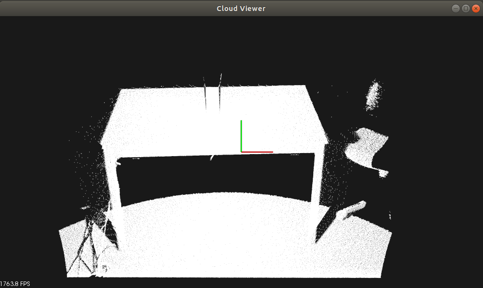
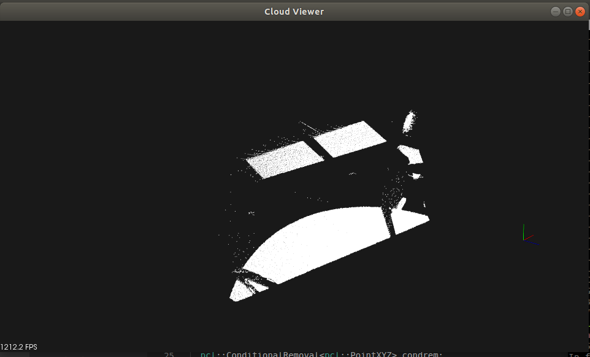

# Basic Point cloud process practice

C++, Python example from PCL, Python-pcl.
- [x] Read pcd (~~C++~~, ~~python~~, Summary)
- [x] Passthrough filter (~~C++~~, ~~python~~, Summary)
- [x] statistical outlier filter(~~C++~~, ~~python~~, Summary)
- [x] Point Feature Histogram(~~C++~~, python, Summary)
- [x] Fast Point Histogram(~~C++~~, python, Summary)
- [x] Viewpoint Feature Histograms(~~C++~~, python, Summary)
- [x] Segmentation & Extracting indices from a PointCloud(~~C++~~, python, Summary)
- [x] normal estimation using integral images(~~C++~~, python, Summary)
- [x] Downsampling a PointCloud using a VoxelGrid filter(~~C++~~, python, Summary)
- [x] Projecting points using parametric model(~~C++~~, python, Summary)
- [x] Removing outliers using a conditional and radiusoutlier removal (~~C++~~, python, Summary)
- [x] KdTree (~~C++~~, python, Summary)
- [ ] 3D Object Recognition based on Correspondence Grouping (C++, python, Summary)
- [ ] Point cloud compression octree (C++, python, Summary)
- [ ] Spatial Partitioning and Search Operations with Octrees (C++, python, Summary)
- [ ] Create ange image (C++, python, Summary, **working on**)
- [x] extract borders from range images (~~C++~~, python, Summary)
- [ ] Implicit Shape Model (C++, python, Summary)
- [ ] iterative closest point (C++, python, Summary)
- [ ] incrementally register pairs of clouds (C++, python, Summary)
- [ ] Interactive Iterative Closest Point (C++, python, Summary)
- [ ] Cylinder model segmentation (C++, python, Summary)
- [x] Region growing segmentation (~~C++~~, python, Summary)
- [ ] Color-based region growing segmentation (C++, python, Summary)
- [ ] Difference of Normals Based Segmentation (C++, python, Summary)
- [ ] Smoothing and normal estimation based on polynomial reconstruction (C++, python, Summary)
- [ ] etc# point_cloud_practice

### Read pcd 

### Passthrough filter

### Statistical outlier filter

### Segmentation 

### Downsampling voxel

### Normal estimation using integral image

### Projection

### Conditional filter

### Radius outlier filter

